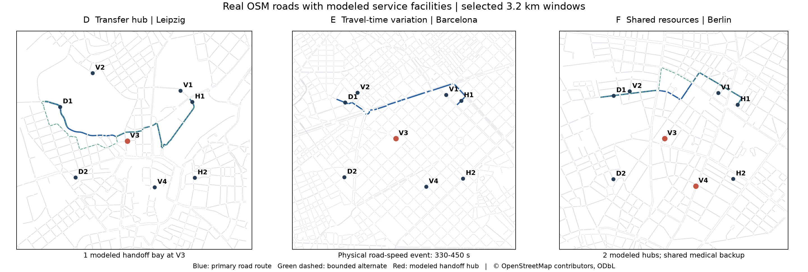

# D/E/F 真实 OSM 场地落地报告 v0.2

2026-09-18。本轮已下载真实OSM数据，完成15个候选窗口的结构筛选，落地三个SUMO地图包、设施和资源配置，并验证逐场地单载荷空地闭环。正式六场地实验尚未启动，模型调用为0。

## 1. 入选场地

| Site | 区域 / 候选 | 执行结构 | 可通行道路边数 | 交通灯系统数 | 冗余OD数 / 8 |
|---|---|---|---:|---:|---:|
| D | 莱比锡 / D_03 | V3一个交接位，多个可达起终点 | 2,522 | 59 | 8 |
| E | 巴塞罗那 / E_02 | 真实道路限速事件与时变ETA | 2,775 | 408 | 5 |
| F | 柏林 / F_04 | V3/V4两枢纽、共享医疗备用机及兼容限制 | 2,103 | 49 | 8 |

每个候选为3.2×3.2 km窗口。每类的五个候选来自同一区域、相邻中心偏移0.75 km，属于**重叠地图窗口**，不是十五座独立城市。道路来自OSM；D/H/V坐标为模拟服务点，按可通行车道吸附，不声称这些位置已有实际医院、仓库或起降许可。

图中蓝色为参考地面路径，绿色虚线为有界搜索得到的一条替代路径，红点为模拟交接枢纽。PNG/SVG均保存于 `sites/figures/`。

## 2. 选择规则和版本记录

筛选只使用道路结构及共同参考路线，不运行FULL/LST。规则先写入 `sites/selection_rule.json`，再计算全部候选：最大强连通道路分量占比至少0.65；八组OD至少两组找到合理替代路；参考路径长度100–6,000 m；E至少五个信号系统；F两枢纽相距至少500 m。替代路搜索最多阻断八条参考边，要求长度≤1.25倍、与原路距离重叠≤0.8；报告的是路径数**下界**，不是穷举路径总数。

合格后按确定性字典序选择：D优先冗余OD数、强连通比例、较少死端；E优先信号系统数、冗余OD数、强连通比例；F优先冗余OD数、枢纽间距、强连通比例；最后以候选编号打破平局。每一项分数、坐标、边界和转换命令均在对应 `site_candidate_report.json`。

第一轮采用旧平台的静态信号导入选项，E探针在1200 s窗口内未全部到达。依照 [SUMO官方导入建议](https://sumo.dlr.de/docs/Networks/Import/OpenStreetMap.html)，本轮统一为全部15个窗口补充 `--tls.join --tls.discard-simple --tls.default-type actuated` 并重新筛选。旧候选、初选地图和规则保存在 `sites/archive/import_v1/`；失败探针保留在 `runs/site_diagnostics/`，没有覆盖或隐藏。

这是无被比较控制器的工程修订，不是根据某方法收益换地图。新信号为仿真假设，未核对真实现场相位；不同导入版本的信号计数不可直接解释为现场差异。

## 3. 实际运行证据

### 单载荷闭环

| 场地 | 实际共同就绪/交接开始 | 交接完成 | SUMO到达 | 卸载后送达 | 结果 |
|---|---:|---:|---:|---:|---|
| D | 432 | 462 | 594 | 609 | PASS |
| E | 420 | 450 | 601 | 616 | PASS |
| F | 421 | 451 | 607 | 622 | PASS |

时间为仿真绝对秒；释放300、装载完成315、故障360、地面承诺365，交接30 s、卸载15 s。实际飞行状态到位后才交接；地面到达来自SUMO事件。每次固定模拟慢响应在480 s返回并被过期检查丢弃；并未调用GPT。F诊断创建第五个静态飞机占位，但尚不运行五机多任务争用。

新增场地支持后，原A默认闭环也通过回归，送达仍为625 s，见 [A回归报告](../runs/development/physical_20260918_165704_afc781/report.json)。

当前运行路径：

- D：[`physical_20260918_165138_8479c8`](../runs/development/physical_20260918_165138_8479c8/report.json)。
- E：[`physical_20260918_165143_c7698c`](../runs/development/physical_20260918_165143_c7698c/report.json)。
- F：[`physical_20260918_165148_8310e6`](../runs/development/physical_20260918_165148_8310e6/report.json)。

各目录保存fixture、网络hash、事件及逐秒轨迹。诊断使用BlueSky的PerfBase和M600占位；尚未标定飞行动力、能耗、空域约束或真实通信协议。上述结果验证单载荷链，不等于D/F多任务协议验收，也不是R6方法比较结果。

### 交通探针

三个场地均运行七辆固定OD探针，共同发车计划为270、300、330、360、390、420、450 s，并使用预先确定的背景交通。D/F做名义诊断；E做名义与330–450 s物理限速的配对诊断。未启用传送完成。

E七组实际行程差值为 **+75、0、−22、+94、+277、+291、−189 s**；没有只保留变慢的轨迹。感应信号和排队会改变后续行程，负差值也是实测结果。所有探针最终到达，但部分超过900 s；观察延长到1800 s仅用于记录真实到达，不计为正式900 s内及时完成。

证据：

- D：[名义交通诊断](../runs/site_diagnostics/D_20260918_163938_4fd08e/report.json)。
- E：[限速配对诊断](../runs/site_diagnostics/E_20260918_163933_f75e65/report.json)。
- F：[名义交通诊断](../runs/site_diagnostics/F_20260918_163941_5b8dd0/report.json)。

当前ETA统计采样共同窗口250–600 s、间隔10 s，取固定路径上SUMO当前edge travel-time之和。停止车辆可能使瞬时估计显著增大，因此signature同时标注估计来源，不能把其CV误称为实测OD行程的CV。F也有较高估计波动；这三个场地不是只改变单一因素的因果对照。

## 4. 已交付文件

每个 `sites/frozen/D|E|F/` 包含：

- `network.net.xml`、`site.sumocfg`、`routes.rou.xml`：真实网络与可加载配置。
- `site_config.json/yaml`、`facilities.json`、`candidate_facilities.geojson`：服务设施及车道位置。
- `compatibility.json`：任务类别、载具、合法服务点、容量与共享优选资源。
- `external_events.json`：E实际道路事件；D/F为空事件表。
- `site_signature.json`、`route_diagnostics.csv`：结构、时间、交接集中度和资源耦合诊断。
- `selection.json`、`asset_manifest.json`：来源、选择与文件SHA-256。
- `acceptance.json`及诊断指针：每项进度和未通过的正式门。

OSM原始文件、下载时间、端点、查询及hash位于 `sites/sources/`。版权及许可为 [© OpenStreetMap contributors，ODbL 1.0](https://www.openstreetmap.org/copyright)。数据来自真实道路，兼容关系与处理时间是研究设计，二者在文件中分开记录。

`fixtures/development/` 新增D/E/F各两个开发骨架。每任务保存参考阶段组成和数值期限；F只标候选链，尚未证明最优合法参考方案。未补齐正式初态、完整随机流和现场标定，不得据此开启正式批量运行。

## 5. 其他设计文档和实验预算

已更新：主协议v0.2、机器配置v2、六场地注册表、计划生成器和CSV、模型调用契约、复用索引、根README、研究README、实现状态入口及下一阶段计划。v0.1原计划与已有结果保留。

原R2–R5分配保持：R2=A，R3=H_A/A和H_B/B，R4=C，R5=A。新增 **R6_SITE=240**；可选 **R6_B2=120**。基础运输计划 **3,821**，可选 **440**；本轮筛选与诊断另立账本。Astra high原生预算不扩张，也没有本轮实验模型调用。

新增场地身份进入环境和配对签名；R6种子独立为20271201–20271210。正式fixture缺失时规划ID明确标为planning-only。资产hash、车道/转向、兼容矩阵和240个R6单元的120对配对均通过 [一致性检查](../outputs/site_integration/verification.json)。

## 6. 尚未完成的验收

地图资产本版已冻结，但所有场地 `formal_admission=false`：D仍需双任务单bay队列及保管权检查；E需开发期限/负载标定，确认正式900 s条件；F需真实执行层兼容性、双重分配防护、预约过期及下游释放验证。A/B/C仍需同口径signature重算与新语义fixture。原R0桥接、完整R1及原生适配器的待办不因新增地图自动完成。

本轮设计审阅采纳了配对身份包含全部资产、逐任务参考阶段图、候选链与最优合法链区分、H_A/H_B原地理映射四项修正。正式方法结果未知；收益为零或负不能成为拒收地图或删seed的理由。

详细事实表、章节契约及审查处置见 [修订审查记录](../outputs/researchwrite/six_sites_v0.2/revision_audit.md)。
