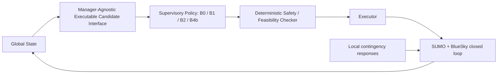

# Transportmetrica B 写作蓝图：Ground–Low-Altitude Mobility Manager

日期：2026-09-10。文档类型：研究定位、章节设计与证据使用计划；不是论文全文或新实验方案。

**推荐定位：提出并评估一个统一的 ground–low-altitude supervisory mobility manager architecture，研究扰动如何改变运输服务的可行替代方案，以及不同监督策略能否在执行约束与剩余时间内利用这些方案。LLM 是其中一种 policy implementation。**

本蓝图依据现有英文 manuscript、`paper_final_20260910` 最终发布结果、冻结接口与目标函数说明，以及相关实现核查。只新增本文件；不修改原始数据、当前 manuscript、frozen manager、prompt、B2 objective，也不运行实验或重新生成发布包。

## 0. 证据入口、版本与写作边界

### 0.1 使用顺序

| 来源 | 用途 | 写作规则 |
|---|---|---|
| [S1：当前 manuscript][S1] | 判断哪些论证、定义和图表可以迁移 | 已完整阅读；它是重构起点，不是不可修改的叙事约束 |
| [S2：最终 results.json][S2] | E1-final、E2-corrected、E3-v2、E4-v2 的正式数值与统计 | 主结果唯一数值入口；优先于旧报告和案例中的统计 |
| [S3：最终 main_results.csv][S3] | 核对三站点、四管理器的汇总值 | 不跨实验拼成一个总平均性能排名 |
| [S4：发布包说明][S4]、[S5：verification.json][S5] | 数据规模、修正口径、发布检查 | 25 项 PASS 是已有发布记录；本次未重新执行这些检查 |
| [S6：现有写作指南][S6] | 最终版本的实证解释 | 保留事实，将“LLM 全局监督”进一步转为“统一 manager architecture” |
| [S7：候选接口公平性审计][S7]、[S8：B2 目标冻结][S8]、[S9：prompt 冻结][S9] | 信息合同、策略边界、消融定义 | “统一”指同一实验内共享信息生成与执行合同，不指所有实验输入字节完全相同 |
| [S10：形态 CSV][S10]、[S11：形态验证][S11]、[S12：跨站点控制说明][S12] | 空间背景与运输机会解释 | 形态报告描述网络构建阶段；实验时间、工作负荷和故障适配以正式协议为准 |
| [S13：冻结源码快照][S13] | 核对 B0/B1/B2、候选扩展、校验和队列语义 | 是分析期快照；不能代替每次运行原有 provenance |
| [S14：E4 最终报告][S14]、[S15：E1 案例 CSV][S15] | 时序机制、实际动作、服务权衡 | 案例事实可用；统计仍回到 S2 |

已核对的关键 JSON 路径包括 `E1.{A,B,C}.summary/ablation`、`E1.A.b4b_vs_b2_scenarios`、`E2.A.b4b_vs_b2_family`、`E3.{A,B,C}.levels` 和 `E4.{4A,4B,4C}.arms`。这些是 JSON 内部路径，不是新的分析产物。

### 0.2 样本与比较边界

| 实验 | 冻结设计 | 正式运行 | 附加消融 |
|---|---|---:|---:|
| E1 | 12 场景 × 20 seeds × 4 managers × 3 sites | 2,880 | B4a：6 场景 × 10 seeds × 3 sites = 180 |
| E2 | 16 场景 × 20 seeds × 4 managers × 3 sites | 3,840 | 0 |
| E3 v2 | 12 场景 × 20 seeds × 4 managers × 3 sites | 2,880 | 0 |
| E4 v2 | Site A；4A/4B/4C 分别为 400/560/400 | 1,360 | 0 |
| 合计 | 每个正式场景–臂–管理器单元 20 seeds | **10,960** | **180** |

正式 seeds 为 20240601–20240620；消融每站点是 60 对 B4b–B4a，180 是额外 B4a 运行数。不要把消融写成 180 个场景，也不要将所有运行当作独立城市样本。E3 每个 manager 的 L1/L2/L3/L4 分别为 40/80/80/40 次，聚合按运行等权，而非四个 level 等权。[S2]、[S4]

### 0.3 需要先纠正的叙事习惯

- **B0 的 ground-only 是紧急任务不获得跨层空中支援。** 背景航空服务及共同本地应急机制仍存在；B0 也不是“什么都不做”。
- **B0 对协调管理器**比较的是启用空地服务重配置后的整体变化，包含可使用运输方式的差别，不能全部归因于策略智能或候选接口。
- **B1、B2、B4b**比较的是同一信息与执行合同下的不同监督策略。各策略造成不同状态轨迹后，实际候选当然可能不同；共享生成规则不等于跨运行每时刻候选表相同。
- **B4a–B4b**是同一 LLM 的显式候选接口消融。它支持该实现对显式候选表达的敏感性，不证明所有策略均因接口获得同样增益，也不是整个架构的有/无对照。
- **“结果收敛”只指观测到的结果接近或部分单元相同。** 未预设等效界值，不写 statistical equivalence、non-inferiority 或所有动作完全一致。

## 1. 推荐标题：五个候选

| 优先级 | 英文标题 | 适用理由与边界 |
|---|---|---|
| **1** | **A Ground–Low-Altitude Mobility Manager for Service Reconfiguration under Disruptions** | 主体、运输任务与扰动问题清晰；不预设哪种策略更好；最适合作为首选 |
| 2 | Supervisory Management of Ground–Low-Altitude Mobility: Service Reconfiguration and Recovery under Disruptions | 强调监督决策与恢复过程；适合更突出 transport dynamics 的版本 |
| 3 | Ground–Low-Altitude Mobility under Disruptions: A Common Architecture for Supervisory Policy Comparison | 最直接体现统一接口和公平比较；方法定位清晰，运输机制需由摘要进一步突出 |
| 4 | Service Reconfiguration in Ground–Low-Altitude Transport: Supervisory Policies across Three Network Contexts | 突出三站点条件差异；用 contexts 避免暗示已识别 morphology 的独立因果效应 |
| 5 | From Feasible Paths to Timely Recovery: Supervisory Management of Ground–Low-Altitude Mobility | 强调最有辨识度的运输结论；标题中的 timely recovery 是研究问题，不是对所有场景的成功承诺 |

标题不出现 LLM-supervised、LLM-driven optimal、intelligent superiority、universal resilience。摘要和方法中如实交代 LLM，不隐藏其参与。正文首次定义 Ground–Low-Altitude Mobility Manager，之后用 mobility manager 或 supervisory manager，避免制造不必要缩写。

## 2. 一句话核心 scientific claim

> **在所测试的扰动场景中，统一候选接口与执行约束下的空地监督管理使服务重配置及策略比较成为可能，而重配置能否转化为及时服务收益取决于站点相关的运输替代条件、服务取舍及观察—执行时序；不同监督策略因此可能收敛，也可能表现出不同的速度—服务保持权衡。**

对应的英文 claim 结构：a common supervisory architecture → comparable executable alternatives → conditional service benefits → dependence on transport context and timing → policy convergence or trade-offs。

该 claim 的架构部分由实现、合同与版本记录支撑；条件性结论由 E1–E4 支撑；站点机制属于与数据一致的解释，不是三城市形态因果定律。不要写“只有该接口才能实现有效协调”，因为没有测试所有其他接口。

## 3. 论文整体叙事主线

### 3.1 从运输问题推进到架构和证据

1. **运输系统问题：** 地面扰动使紧急任务变慢；低空资源提供另一种运输方式，但资源有限，重分配会影响在途服务。
2. **动态困难：** 低空系统自身也会故障，已选方案会失效；找到路径、建立替代服务和按时完成是三个不同阶段。
3. **架构需求：** 需要把路网、任务、飞机、设施、故障与时间信息转成共同的可比较运输候选，再让不同 policy 选择，最终统一校验和执行。
4. **比较设计：** 用 B0 建立 ground-only reference，用 B1/B2/B4b 比较不同监督政策；另用 B4a–B4b 检查显式候选表达的作用。
5. **递进证据：** E1 研究何时值得调用/重分配空中运力；E2 研究空中支援失效后的替代服务；E3 研究复合扰动与多任务损失；E4 研究有效方案是否赶得上实际执行窗口。
6. **运输结论：** 应讨论“保住了哪些服务、代价是什么、何时来不及”，而非哪个算法获得最多第一名。

### 3.2 四个研究问题

| 编号 | 研究问题 | 主证据 |
|---|---|---|
| RQ1 | 地面扰动、任务紧迫度与空中工作负荷如何共同决定重配置价值及既有服务代价？ | E1 主比较、E1_H_H_high 案例、接口消融 |
| RQ2 | 低空故障发生后，哪些恢复路径能建立，哪些能在剩余时间内保护服务？ | E2 条件恢复与全样本截止期；E3 分层损失 |
| RQ3 | 相同监督架构在三种网络与运营背景下，为什么出现不同的协调收益和策略差距？ | E1/E2/E3 三站点；形态与场景控制表 |
| RQ4 | 观察调度、执行等待及输入负担分别怎样影响管理器的运行表现？ | E4A/B/C；全策略结果和 LLM 专属成本 |

### 3.3 贯穿全文的机制链

**Network and facility context → ground/air completion alternatives → disruption-dependent feasibility and time margin → supervisory choice → execution or supersession → deadline and service outcomes.**

这是一条组织证据的解释链，不是已拟合、识别或验证的因果模型。城市名只用来定位研究区；需要解释的是替代路线、可用资源和时间余量。

## 4. Introduction：逐段功能设计

建议 7 段，贡献列表嵌入最后一段附近。篇幅由正式期刊模板确定，不在蓝图阶段硬套未经核实的字数限制。

| 段落 | 功能 | 必须交代的内容 | 证据/下一段连接 | 避免 |
|---|---|---|---|---|
| P1 | 建立 transport dynamics 问题 | 扰动后的服务不是简单“有路/无路”；任务到达、资源占用、期限与恢复进程相互作用 | 交通脆弱性/韧性文献；引出跨方式替代 | 从生成式 AI 发展史开篇 |
| P2 | 解释 ground–low-altitude 协调的机会与代价 | 空中绕过地面绕行；重分配可能中断较低优先级服务；低空资源也依赖设施与通信 | 空地协同与动态运力调度；引出持续重配置 | 暗示已模拟完整乘客出行链或城市级 UAM |
| P3 | 确定决策尺度 | supervisor 反复选择任务、资源、方式和服务调整；低层飞行应急独立运行 | 一次派飞不能覆盖后续故障；引出共同架构 | 把全局监督写成飞控或全网最优控制 |
| P4 | 具体化架构缺口 | 需要把异构状态映射为共同的候选事实，分离可行性、偏好与执行；不同政策必须可比较 | 陈述本文研究的组合问题；引出 manager-agnostic interface | 声称规则/优化无法处理动态信息，或“此前没有人统一状态” |
| P5 | 提出 mobility manager | 完整六段架构；B0/B1/B2/B4b；LLM 只在这里作为实现之一出现 | 定义 global 为单个研究区内联合服务状态 | 把 LLM 方框放在框架中心，其余当附属工具 |
| P6 | 陈述研究问题和证据边界 | 四实验递进、三个 OSM 路网背景、共享协议；介绍收敛、服务权衡与及时性 | 交代仿真、有限场景，不在此堆全部显著性数值 | 用运行总数替代设计质量论证 |
| P7 | 列出贡献并形成阅读路线 | 架构/接口；服务重配置的条件性证据；运行时序；连接章节 | 使用第 12 节贡献措辞 | 将某个相对 B0 百分比写成 LLM 的核心创新 |

开篇的具体情境可以沿用“紧急血液运输遇道路中断，转用飞机又遇航空故障”，但保持为模型化服务实例，不写未经验证的真实事件。引言结束应让读者清楚：本文比较管理决策如何使用共同运输机会，而不是举办 LLM 算法竞赛。

## 5. Related Work：分类、gap 与补文献计划

当前相关工作只有两大主题且 AI 比重偏高。建议改为四类，并以一个短定位段结束。文献综述以运输研究为主，AI 工作只承担解释 policy implementation 的作用。

| 类别 | 要讨论的研究对象 | 与本文连接 | 合理 gap 表述 | 文献工作 |
|---|---|---|---|---|
| 5.1 Transport disruption, vulnerability and service resilience | 路网失效、服务能力下降、恢复与性能损失；连通性和时间表现的区别 | E2 路径恢复 vs 截止期；E3 多服务损失 | 本文关注通过跨方式资源重配置恢复服务，不把道路维修或恢复原有网络作为唯一恢复方式 | 保留 Mattsson–Jenelius；补运输服务恢复、时变脆弱性和多方式韧性研究 |
| 5.2 Dynamic fleet management and ground–air coordination | 动态需求、任务重分配、资源兼容、truck–drone/UAM 协调 | 当前问题是异构资源下重复的服务干预，不是完整配送巡回路线求解 | 将地面扰动和航空支援失效放入同一闭环服务决策实验，并显式保留既有任务代价 | 保留 flying sidekick 作为先例；补动态车辆调度及重优化研究 |
| 5.3 Supervisory architectures, executable actions and constrained execution | 状态到候选、政策选择、约束检查、低层执行的职责划分 | 候选接口是运输服务决策合同；校验不随 policy 改变 | 研究共享候选与执行合同下的监督策略比较及其运行时间条件 | 正式写作前补交通监督控制、约束执行相关原始论文；不宣称发明分层控制或安全过滤 |
| 5.4 LLMs as one supervisory policy | 语言决策的环境 grounding、结构化输出和输入负担 | B4b 的实现方式；B4a 消融和 E4C 成本 | LLM 的有效性需与相同信息下的简单策略一起评价，并以实际运输结果衡量 | 保留少量 SayCan、LLMLight；ReAct 简化；长上下文研究移至输入负担讨论或短句 |

**最终 gap 的写法：**现有研究分别提供了韧性评估、动态调度、空地运输耦合和高层决策组件；本文聚焦的组合问题是，在共同信息和执行合同下，比较不同 supervisory policies 如何应对地面—低空连续扰动，并解释服务收益随站点运输条件和执行时序而变化的机制。使用“we study / we bring together / we evaluate”，不使用未经系统检索支持的“the first / no existing study”。

已核实可用的文献入口如下；本次只做定位所需核查，不冒充完成系统综述：

- 交通韧性概念：[Mattsson and Jenelius, 2015](https://www.sciencedirect.com/science/article/pii/S0965856415001603)。用于支撑运输性能与扰动后恢复视角。
- 网络指标与案例之间的衔接：[Jenelius and Mattsson, Road network vulnerability analysis, 2015](https://www.sciencedirect.com/science/article/pii/S0198971514000192)。用于组织“概念—可测指标—案例”的形态证据，不能借此宣称本文已识别形态因果效应。
- 动态调度背景：[Pillac et al., A review of dynamic vehicle routing problems, 2013](https://www.sciencedirect.com/science/article/pii/S0377221712006388)。用于说明动态信息下的调度已有成熟研究，不能将 B2 简化为整个优化领域。
- 可执行能力与高层语言选择：[Ichter et al., SayCan, 2023](https://proceedings.mlr.press/v205/ichter23a.html)。只支持 grounding 的设计背景，不支持运输性能优势。

上述部分出版社页面直接访问受限，已核对其可检索的题录/摘要；没有据此写细粒度方法优劣。当前 manuscript 的其余文献保留为候选引用，正式成稿时再按具体论断核对原文。Transportmetrica B 近年具体相关论文仍应补读，不能拿期刊 scope 代替领域文献，也不为凑本刊引用而引用无关工作。

## 6. Problem Formulation：保留、澄清和新增的数学定义

数学表达用于准确描述已经实现的监督决策问题。以下“新增”均为建议写作符号或诊断定义，不表示本次新增了求解器、指标数据或实验。

### 6.1 保留并加强的对象

| 定义 | 处理 | 关键澄清 |
|---|---|---|
| 地面网络与联合状态 | 保留原式 (1)，补网络与设施角色 | 全局状态覆盖一个研究区内建模服务；并非真实世界全知状态 |
| 任务 release、deadline、priority、state | 保留；统一用绝对时刻和持续时间 | E1 HIGH/CRITICAL 的 slack 分别为 300/180 s；E3 第二紧急任务 HIGH slack 为 240 s，不能混用 |
| 飞机兼容性、占用、可指挥性与续航 | 保留 | 资源数不等于某任务可用的资源数 |
| 动作与状态转换 | 保留但拆开 proposal、checking、execution | 策略选出的动作不等于成功执行，更不等于完成运输 |
| B2 冻结目标 | 保留原实现，移到 policies 小节最合适 | 它是一个 manager 的偏好函数，不是所有管理器共同优化的总目标 |
| completion、deadline、damage、conditional recovery、SWL | 保留当前正式定义 | 不把速度、按时率和服务损失混成“performance”单一维度 |

可以将地面网络写为 $G^g=(V^g,E^g)$，时变路段运行量/路由估计进入 $G_t$；低空侧以资源、设施、路线和限制集合表示。不要为排版对称而暗示已实现完整多层 passenger-flow conservation 模型。

联合状态沿用：

$$
S_t=(G_t,A_t,I_t,M_t,E_t),\qquad \widehat S_t=\mathcal O_t(S_{0:t}).
$$

建议用一般观测算子 $\mathcal O_t$ 包含采样和同秒事件顺序，而不是只写 $\widehat S_t=S_{\tau(t)}$ 就认为时间标签足以描述信息。可同时保留时间戳 $\tau(t)$ 和 age $t-\tau(t)$；E4A 中 age 为零仍可能尚未包含同秒新任务。

### 6.2 将候选表示与可行集合明确区分

建议使用 $\mathcal I_t=\Phi(\widehat S_t)$ 表示**提供给 manager 的候选信息接口**，$\mathcal C_{m,t}$ 表示其中对任务 $m$ 标记为合法的候选子集：

$$
\mathcal C_{m,t}=\{c\in\mathcal I_{m,t}:\operatorname{legal}(c\mid\widehat S_t)=1\}.
$$

接口的典型记录可抽象为：

$$
c=(m,r,\text{mode},\text{action},\widehat\eta_c,\text{legality},
\text{endurance},\text{incumbent service},\text{destination},\text{failure reason}).
$$

**重要：现有候选表也包含非法资源及 reject reason。** 因此不能把“整个表”定义成只含合法行；executable candidate interface 指它给出可执行性及其依据，policy 应选择合法候选，最终仍需执行时检查。表中预测截止期差值可能为负，B2 的 late penalty 则是截断后的非负量，二者分开命名。

候选生成不使用 B2 权重、最优标签或推荐动作。E3 多任务按优先级/截止期组织，且重分配受严格优先级约束；因此 **manager-agnostic 不等于无组织规则、无价值约束或完全中性的表示**。它表示所有 manager 共享这些规则，且没有隐藏 B2 的候选评分。[S7]、[S8]、[S13]

### 6.3 将政策选择和执行状态分离

$$
a_t^{\mathrm{prop}}=\pi_k(\widehat S_t,\mathcal I_t),
\qquad k\in\{\mathrm{B0,B1,B2,B4b}\}.
$$

其中 $\pi_k$ 输出 action contract 中的一个结构化干预，也可以是 NO_ACTION 等管理动作；不要写成所有输出都必须是一条 air candidate。B0 将可选择的紧急任务支援限制为 ground，B1/B2 先按冻结规则确定目标任务；LLM 可利用多任务表达选择干预。

设计划执行时刻为 $t_e=t+\delta_{\mathrm{exec}}$，令 $Q$ 表示动作仍为该任务的有效待执行版本，$\Gamma$ 表示共同的语义与可行性校验：

$$
u_{t_e}=\begin{cases}
\operatorname{Executor}(a_t^{\mathrm{prop}},S_{t_e}), & Q(a_t^{\mathrm{prop}},t_e)=1\ \land\ \Gamma(a_t^{\mathrm{prop}},S_{t_e})=1,\\
\varnothing, & \text{otherwise}.
\end{cases}
$$

$$
S_{t+1}=F(S_t,u_t,e_t,\ell_t),
$$

其中 $e_t$ 为外部扰动，$\ell_t$ 为共同本地 contingency response。这个写法是职责抽象；正式实现按当前动作类型归一化与二次校验。被后续命令 supersede 和被 checker reject 是不同原因，日志中分别保留；不要把 $\varnothing$ 解释为每种失败都自动触发一个新地面方案。

### 6.4 新增“预计及时可行集”，连接 resilience 与 timing

把原 Discussion 式 (11) 前移，明确是基于 ETA 的诊断：

$$
\sigma_m(c,t)=d_m-t-\delta_{\mathrm{exec}}-\widehat\eta_c,
\qquad
\mathcal C^{\mathrm{timely}}_{m,t}
=\{c\in\mathcal C_{m,t}:\sigma_m(c,t)\ge0\}.
$$

由此形成三个概念：有合法候选；有预计按时的合法候选；所选干预真正执行并按时完成。非空 $\mathcal C_{m,t}$ 不保证非空 $\mathcal C^{\mathrm{timely}}_{m,t}$，后者也不保证真实成功，因为 ETA 误差、后续故障和队列替代会改变执行结果。

这一定义有助于解释 E2/E3/E4，**不把未计算的 timely-candidate counts 写成已观察指标**；不把候选 ETA 当作精确到达保证；不根据该式宣称已经证明稳定性、递归可行性或最优性。

### 6.5 保留 B2 的实际冻结目标

$$
J_t(c)=\widehat\eta_c+10\max(0,t+\widehat\eta_c-d_m)
+\mathbf1_{\mathrm{preempt}}(c)(\kappa_{p(c)}+30)+10\rho_c,
$$

$$
\kappa_{\mathrm{LOW,NORMAL,HIGH,CRITICAL}}=(20,40,80,100000),\qquad
\rho_c=\mathbf1[b_c<120]+\mathbf1[b_c<60].
$$

ground 没有抢占与续航风险罚项；它与 air 使用相同 completion/deadline 项，没有额外 ground-delay 权重。目标为配置的 seconds-equivalent 权衡，**不是社会福利估值**。CRITICAL 抢占项虽有值，同级/更高优先级抢占已被约束排除。准确名称：**fixed-objective one-step candidate-ranking heuristic**，可补充它在当期候选中最小化标量目标；不能称为全时域最优、MILP 或 MPC。[S8]

### 6.6 保留服务指标，并明确 resilience 的操作化含义

$$
T_m=c_m-r_m,\qquad V_m=\mathbf1[c_m>d_m].
$$

恰好达到截止期算按时；E1 的 primary 字段虽名为 critical，也含 HIGH urgency，正文统一称 emergency completion。

受影响标记记为 $A_i$、路径恢复记为 $R_i$：

$$
\widehat P_{\mathrm{rec}}=\frac{\sum_iA_iR_i}{\sum_iA_i}.
$$

当分母为零时是 N/A；恢复时长比较只用两种 policy 都受影响的配对；全样本 completion/deadline 不能因为无故障暴露而剔除。failure-to-replan 用首个已发出的任务动作，排除 NO_ACTION；它也不等于壁钟推理时长。

E3 沿用：

$$
L_H=\sum_{m\in M_H} w_{p_m}\ell_m(H),\qquad
w_{\mathrm{CRITICAL,HIGH,NORMAL,LOW}}=(4,3,2,1),
$$

$$
\ell_m(H)=\begin{cases}
q_m^{\mathrm{delay}},&m\text{ completed late},\\
q_m^{\mathrm{cancel}},&\operatorname{state}_m(H)\in\mathcal U,\\
0,&\text{otherwise},
\end{cases}
\quad
\mathcal U=\{\mathrm{CANCELLED,FAILED,INTERRUPTED,NEEDS\_REPLAN,WAITING}\}.
$$

late 是固定一次罚值，不乘延误秒数；正常 EN_ROUTE/ASSIGNED 在 horizon 不罚。CRITICAL 迟到的 240 和第二 HIGH 迟到的 135 是 configured loss units。damage 是非主任务在 horizon 的受损终态数，不是所有历史中断次数。

本文 resilience 用路径恢复、按时完成、既有服务保持和优先级加权损失共同刻画。**没有测网络完全恢复、道路修复、全系统恢复时间或韧性曲线面积，不新增一个虚构的综合 resilience index。**

## 7. Ground–Low-Altitude Mobility Manager framework：章节结构

框架章标题建议直接用 **Ground–Low-Altitude Mobility Manager**，代替 Global LLM-Supervisory Framework。

### 7.1 必须呈现的主架构



正式图中六个主模块并列；policy 框内四种实现同等视觉权重；B4a 以接口消融的旁注出现。本地应急支路不经 LLM；事件、任务注册表及共同时间轴可用辅助箭头表示。图注应明确 Safety 指所建模运行规则的检查，不是适航认证或形式化安全保证。

### 7.2 六个小节及各自任务

| 小节 | 应写内容 | 应提供的可核查证据 |
|---|---|---|
| 4.1 System boundary and global state | 地面/低空/设施/任务状态、1 s master step、任务 registry、事件和观察时刻 | 原 framework 的平台说明；将具体软件版本放实验/附录 |
| 4.2 Manager-agnostic executable candidate interface | 输入输出字段、合法与非法行、ETA、抢占后果、ground option、失败原因；不含 B2 score | 一张小型字段表；同一状态如何同时供给三种协调 policy |
| 4.3 Supervisory policies | B0、B1、B2、B4b 的目标/排序/动作限制；B4a 为消融 | 固定顺序 policy 表；B2 原公式；B1 的 air-first 明确写出 |
| 4.4 Deterministic safety and feasibility checking | schema/标识/语义/兼容/任务占用/优先级/目的地/故障限制；当前状态复核 | candidate builder 与 checker 的分工；拒绝不静默“修好”为最优动作 |
| 4.5 Execution, pending actions and local contingencies | 发出、排队、执行、替代、完成；执行量从环境获取；局部应急独立 | E4B 的 versioning/supersession；统一操作语义 |
| 4.6 Closed-loop updates and protocol versions | 事件触发/周期调用、状态回流、E4 观察实验差异；2.0/2.1/2.2 接口扩展 | 版本表与已冻结协议；不将不同实验包装成同一字节配置 |

### 7.3 Policy 表应这样写

| Policy | 使用相同信息时如何选择 | 在比较中的角色 |
|---|---|---|
| B0 ground-only reference | 为目标任务选择可用 ground fallback；不重派空中资源提供跨层支援 | 衡量协调启用后的整体运输收益与代价；背景航空仍运行 |
| B1 air-first rule | 有合法 air candidate 就选 air 内最小 ETA，平局看续航；无可用 air 再考虑 ground | 可解释、低复杂度协调策略；不是全体 air/ground 中的最短时间策略 |
| B2 fixed-objective heuristic | 目标任务按冻结规则选定，对合法 air 与 ground 候选算冻结 $J$ 并选最小值 | 一步多属性权衡；不是运输优化领域的最强代表 |
| B4b LLM-based policy | 同一状态与候选表转为冻结 prompt 输入，返回结构化动作，经同一检查 | 可替换 policy 实例；可靠性与输入成本单独披露 |
| B4a no-table LLM | 与 B4b 同一 prompt 模板、checker；去除候选段 | 仅 E1 接口消融，不作为第五种主管理架构 |

### 7.4 接口需要达到的解释力度

正文至少交代三点：第一，候选 representation 将不同运输方式放到共同剩余完成时间与服务后果尺度；第二，它把管理偏好与环境事实分开；第三，它使选择理由能够与最终动作追踪对应。它不只是文本格式美化，也不穷举全部可能路线或长期调度方案。

原型的统一接口是**共享事实与合同**，不是证明所有 policies 使用每个字段的方式相同；B1/B2 的目标任务选择、LLM 的语义权衡仍是 policy 差异。2.0 服务 E1，2.1 扩展单故障并服务 E2/E4，2.2 支持 E3 多任务；保留该版本差异，避免误写“所有 10,960 次运行使用同一候选表版本”。

## 8. 四个实验的重新解释与不可变事实

### 8.1 E1：选择性低空支援与服务取舍

**新问题：**在何种地面扰动、紧迫度与占用条件下，空中干预值得其服务代价？候选表示能否帮助该 LLM 实例表达这种选择？

每个站点–manager 为 240 次主运行。数值为最终发布均值：[S2]、[S3]

| Site | 指标 | B0 | B1 | B2 | B4b |
|---|---|---:|---:|---:|---:|
| A | completion (s) | 187.667 | 160.775 | 147.617 | 146.633 |
| A | deadline violations (%) | 33.333 | 25.000 | 16.667 | 16.667 |
| A | damage/run | 0 | 0.500 | 0.058 | 0.133 |
| B | completion (s) | 262.667 | 47.700 | 47.700 | 49.096 |
| B | deadline violations (%) | 50.000 | 0 | 0 | 0 |
| B | damage/run | 0 | 0.500 | 0.500 | 0.4875 |
| C | completion (s) | 323.667 | 168.275 | 168.275 | 168.650 |
| C | deadline violations (%) | 83.333 | 10.000 | 10.000 | 10.000 |
| C | damage/run | 0 | 0.500 | 0.500 | 0.500 |

写作顺序：先对比 air support 与 ground-only 的运输收益，再对比协调策略的服务代价，最后讨论接口消融。Site A 的 B4b 相对 B0 约快 21.9% 是其中一个点，不能成为全篇唯一 headline；B2 的 147.617 s 与更低 damage 同样重要。

**关键案例：**E1_H_H_high 中 ground ETA 约 228.617 s，HIGH deadline slack 300 s。B2 20/20 选 ground；B4b 12/20 重分配，8/20 ground；两者均按时。B4b–B2 completion 差为 −11.95 s，95% CI [−17.330, −6.570]，12 个场景的 Holm $p=0.002100$，代价是多 0.600 damaged services/run。称为速度—服务保持权衡；没有算完整 Pareto frontier，不称“证明 Pareto 最优”。[S2]、[S15]

**接口消融：**A 的 60 对中，B4b–B4a completion 为 −13.567 s，CI [−19.753, −7.380]，Holm $p=4.794\times10^{-5}$；damage −0.383/run，air intervention −38.333 个百分点。B 的 completion 差 +1.450 s、Holm $p=0.964$；C 的三个消融终点观测差均为零。说明接口价值随选择情境变化，不写三个站点统一提高。

### 8.2 E2：恢复运输路径与按时恢复服务的分离

**新问题：**航空支援成为故障源后，共同闭环如何恢复运输服务？不同 policies 的恢复时长与最终 deadline 结果有何差别？

六类状态机故障为 C2 link loss、GNSS degradation、UTM degradation/outage、landing-site failure、unknown-aircraft intrusion、flyaway risk envelope；C1/C2/C3 区分外围影响、关键链中断但仍有空中替代、相关空中替代不可用。F3–C2 与 F4–C2 是设计排除，形成 16 场景，不是两个失败运行。故障时刻 A/B/C 为 360/322/383 s，适配当地航空运行。[S1]、[S13]

| Site | B1/B2 completion (s) | B4b completion (s) | B1/B2 recovered/affected | B4b recovered/affected | B4b 全样本逾期率 |
|---|---:|---:|---|---|---:|
| A | 162.000 | 166.525 | 200/200 | 191/191 | 39.063% |
| B | 153.875 | 154.050 | 200/200 | 199/199 | 37.500% |
| C | 278.000 | 278.922 | 200/200 | 201/201 | 62.813% |

每格全样本为 320；所有受影响的 B1/B2/B4b 均恢复替代运输路径。B0 的关键航空链未受影响，恢复为 N/A，不能写成恢复失败率 100%。

**必须保留的不利结果：**Site A 中 B4b 比 B2 慢 4.525 s，CI [1.917, 7.133]，Holm $p=0.008678$；条件恢复时长差 +3.927 s，191 对，CI [0.733, 7.121]，Holm $p=0.162454$。两种终点的结论不同。Site C 的 B4b 受影响数为 201，但 B4b–B2 联合受影响恢复比较为 200 对，不可混用分母。[S2]

**机制解释：**先看故障是否触及当前服务链，再看备用 air 或 ground 如何接续，最后看所剩时间。后端错误留在样本内；不要排除后再宣布 policy 优势。恢复率是已测试场景的路径恢复事实，不是现实安全可靠度。

### 8.3 E3：复合扰动下的服务损失与可用替代条件

**新问题：**当故障累积、两项紧急服务竞争有限医疗运力时，监督重配置保护了哪些优先级服务，何时无法避免损失？

L1 为 2 个单故障单任务锚点；L2 为 4 个两故障单任务级联；L3 为 4 个单故障双紧急任务；L4 为 2 个双任务、多故障组合。第二紧急任务在 300 s 同时释放，HIGH、240 s slack。不要用旧版本“第二任务故障后 30 s 到达”的叙述。

| Site | B0 聚合 SWL | B1 | B2 | B4b | 写作重点 |
|---|---:|---:|---:|---:|---|
| A | 240.000 | 100.000 | 100.000 | 102.125 | 多种协调 policy 都降低平均损失，但平均 primary completion 可更长 |
| B | 307.500 | 127.500 | 127.500 | 127.500 | 该终点三种协调 policy 结果一致，仍有第二任务与复合情形的残余损失 |
| C | 307.500 | 227.500 | 227.500 | 227.500 | 协调收益集中在 L3，其余若干 level 无 SWL 改善 |

此处“降低”指均值差；显著性只在有对应预设检验的位置报告，不因表格百分比自动添加统计显著性。B4b 相对 B0 的描述性减少分别约 57.4%、58.5%、26.0%；B1/B2 的同类收益应同等呈现。

三站点的 compound comparison families 均未发现 B4b 相对 B1/B2 显著降低 SWL 或 CRITICAL+HIGH loss。A 中 L2/L3/L4 的 B4b–B1/B2 SWL 差为 0/+1.6875/+3.375；B/C 对应差为零。没有动作级 priority consistency / resource competition 证据，那两个未实现字段不能当作零违规、100%正确率。

**重要反例：**A 中 B0 primary completion 平均 182 s，B1/B2 187.25 s、B4b 188.796 s，但协调 SWL 更低。因此“平均更快”和“保护更多按时优先服务”不是同一结论。L2 的 A 数据全为 240，不沿用旧报告的 640/648.3 或“级联反噬 +100”。

### 8.4 E4：共同架构的运行时间条件与实现成本

**新问题：**相同可行方案在何时被看到、何时进入执行，会如何改变运输结果？输入增长对 LLM 实现带来什么成本？

新稿不能只复用原 Fig. 6 的 B4b 单条曲线。利用已有最终逐臂结果，规划 B0/B1/B2/B4b 并列或重合标注；token panel 再单独显示 B4b。[S2]、[S14]

| 子实验/臂 | B0 completion (s) | B1 | B2 | B4b |
|---|---:|---:|---:|---:|
| 4A OBS10 | 192 | 140 | 140 | 140 |
| 4A OBS30 | 212 | 150 | 150 | 150 |
| 4A OBS60 | 253 | 180 | 180 | 180 |
| 4A OBS120 | 253 | 240 | 240 | 240 |
| 4A OBS300 | 482 | 521 | 482 | 482 |
| 4B D00 | 182 | 120 | 120 | 120 |
| 4B D01 | 183 | 121 | 121 | 121 |
| 4B D05 | 187 | 125 | 125 | 125 |
| 4B D10 | 192 | 130 | 130 | 130 |
| 4B D20 | 202 | 140 | 140 | 140 |
| 4B D30 | 212 | 150 | 150 | 150 |
| 4B D60 | 302 | 341 | 302 | 302 |

每个单元 20 seeds。以上离散臂结果已存在，本次没有计算新阈值或新增仿真。

**4A 观察调度：**快照构建顺序使 300 s 同秒新任务直到 310/330/360/360/600 s 首次可见；故障发生于 371 s，首次可见为 380/390/420/480/600 s。它同时改变新任务发现和故障发现，不是纯粹“故障状态陈旧实验”。B2 与 B4b completion 全臂相同；B1 在 OBS300 为 521 s，不能把三者画成所有臂完全相同。B4b 62/22/12/7/4 calls/run 反映全 horizon polling；后续服务已完成的调用也计入。OBS60 恰好按时；OBS120 全恢复但全逾期；OBS300 关键链尚未派飞，条件恢复 N/A。

**4B 执行等待：**B2/B4b D00–D30 从 120 到 150 s，D60 到 302 s；B1 D60 为 341 s。用 B4b D60 事件链说明：300 s proposal → 原计划 360 s 执行 → 360 s 故障及新 ground 决策 supersede 原命令 → 420 s ground 执行 → 602 s 完成。不得把 supersession 写成 checker 拒绝。B1 极端臂与其他策略不同的具体动作原因，正式绘图前应从现有日志单独核对；当前只报告差异，不凭空解释。

**4C 输入负担：**N05/10/20/30/50 是总飞机记录数，实际核心机队一直为 4；扩展记录是不可用飞机及惰性任务/设施。B4b completion 121.5/120/120/120/120 s，全部 100 次按时；tokens/logged call 约 3982.1/5920.6/9588.7/13256.7/20593.5。640 组匹配阶段合法候选不变检查是已有发布记录；不是新增活跃运力。N05 一次后端错误导致额外调用机会，不能说输入少反而更难。

**共同限制：**外部 inference 调用时仿真物理时钟不推进；4B 注入 delay，不能当成真实在线端到端延迟实测。E4 共记录 4 次最终 transport-error calls 和 4 次 structured retries，保留披露。4A/4B 主运输结论属于运行时序；4C 主要是该 LLM 实现的成本与选择质量，不是运输系统容量扩展实验。

## 9. 三站点结果如何服务 network morphology 叙事

### 9.1 先描述测得的网络，再解释运输机会

统一研究区为 3.2 km × 3.2 km；地面来自 OSM，服务、低空路线、落点和故障情境为模型设定。不要用“真实路网”偷换成“真实航空运营验证”。

| 已有形态指标 | A：Suzhou | B：Amsterdam | C：Edmonton | 如何使用 |
|---|---:|---:|---:|---|
| directional road density (km/km²) | 19.547 | 23.366 | 18.439 | 网络构建统计；双向道路方向边分别计数，不是街道中心线密度 |
| intersection density (/km²) | 38.770 | 101.758 | 40.918 | 按 ≥3 个不同邻居定义，不能与别的论文未经转换直接比较 |
| mean node degree | 2.830 | 2.663 | 2.420 | 说明分支/连接结构，不单独决定政策收益 |
| dead-end ratio | 0.1845 | 0.1193 | 0.2882 | C 的外围分散与支路背景 |
| mean sampled OD circuity | 1.1969 | 1.1409 | 1.4721 | 是抽样 OD 平均，不是紧急任务 OD 绕行率 |
| D1–H1 network distance (km) | 2.9222 | 1.1192 | 3.4296 | 任务几何背景，需要同时看 ground ETA 与航空几何 |
| D1–H1 circuity | 1.6791 | 1.5446 | 1.3564 | C 的全网平均更高，但这个特定 OD 比值并非最高；必须区分尺度 |
| reference closure ETA increase | 37.87% | 88.69% | 34.76% | 路网构建阶段关键道路关闭的验证值，不替代 E1 各扰动等级 |

数值来自 [S10]，定义来自 [S11]。route redundancy proxy 的 0.28/0.13/0.07 可作为补充指标，但必须写明其来自另一采样程序：对 60 个 OD，基线路径各单边关闭后均存在 ≤1.5 倍路径的比例。它不是独立路径数量；该列不在 S10 主 CSV 中，应链接 S11 的定义和原始计算入口，不混成未经解释的标准连通性指标。

### 9.2 三个机制角色，而非三个城市的优劣排名

| Site | 叙事角色 | 实证连接 | 不应声称 |
|---|---|---|---|
| A | 地面仍有用、空中支援与既有服务保护之间存在取舍的背景 | E1 同时看到 B1 的更高 damage、B2 的服务保持、B4b 的速度取舍；候选消融最明显；E3 L2 无 SWL 改善 | “网格路网必然适合 LLM”，或案例空间分歧完全由形态产生 |
| B | 密集道路中存在跨水体通道约束；局部障碍比整体密度更有解释力 | B 为最密集研究区，参考关闭 ETA +88.69%；E1 协调大幅缩短运输，三种协调 policy 接近；E3 仍有残余损失 | “密度低导致 B 脆弱”；也不能把所有提升归于桥梁关闭，因为任务距离和航空路线同时不同 |
| C | 分散、支路比例高、特定服务距离长，时间余量成为问题 | E1 协调可改善；E2 B4b 62.813% 逾期；E3 L1/L2/L4 没有 SWL 改善而 L3 有改善 | “C 没有协调价值”，或“稀疏路网总是最难/最差” |

B 的“73 个 usable crossings”是区内所有水体几何交叉的计数；S11 另述主屏障的 4 个 crossing。两者不是同一分母，不能将 73 写成 73 条独立跨主河备用通道。地图保留“关键道路关闭”的标记，同时避免地图道路 B1 与 manager B1 混淆。

### 9.3 用 E3 站点 × level 矩阵作为核心证据

下表每格按 B0 / B1 / B2 / B4b 排列，单位为 SWL：[S2]

| Site | L1，n=40/manager | L2，n=80/manager | L3，n=80/manager | L4，n=40/manager |
|---|---|---|---|---|
| A | 240 / 0 / 0 / 6 | 240 / 240 / 240 / 240 | 240 / 0 / 0 / 1.6875 | 240 / 120 / 120 / 123.375 |
| B | 240 / 0 / 0 / 0 | 240 / 120 / 120 / 120 | 375 / 135 / 135 / 135 | 375 / 255 / 255 / 255 |
| C | 240 / 240 / 240 / 240 | 240 / 240 / 240 / 240 | 375 / 135 / 135 / 135 | 375 / 375 / 375 / 375 |

写作时解释这三类现象：**有足够及时替代方案时，多种协调策略可以达到相同损失；方案只能保护部分服务时仍有残余损失；恢复余量不足时，即使有效执行也无法消除迟到罚值。** 将 240/135 与任务罚值对应，但不要仅由聚合均值倒推出每个运行的唯一服务轨迹。

L1–L4 不是同一情境连续加难的严格序列，因为任务数、故障结构和可用资源一起改变。不能将图中的不单调解释为统计错误，也不能拟合“复杂度越高，LLM 相对优势越大”的趋势。

### 9.4 明确跨站点解释的证据层级

1. **已测事实：**路网指标、参考道路关闭效应、各站点固定场景的结果差异。
2. **有实证支撑的解释：**这些差异与地面替代、航空航程、故障后可用资源、任务期限的联合变化一致。
3. **目前未识别：**单独提高路网密度、降低 redundancy 或增加 circuity 对 policy gap 的因果影响；以及可推广到全部城市的关系。

保持同一 fleet composition、policy、prompt、B2 weights、候选语义和执行合同；允许站点几何、OD/设施位置、故障位置与时间适配。E2 故障时间不同，E3 也有站点适配，因此“cross-site validation”宜解释为 architecture reproduction across contrasting contexts，不是严格只改变 morphology 的干预试验。[S12]、[S13]

建议正式图表展示两个不同量：协调相对 B0 的服务收益，以及协调策略彼此的差距。不能把前者的巨大改善当作后者显著差异。所有新增跨站点机制可视化均标为“基于已有冻结输出的后续制图计划”，本次不生成新指标或假说检验。

## 10. Results：每节必须回答的问题与图表安排

### 10.1 建议的结果章节结构

| 小节 | 必须回答的问题 | 主指标与证据 | 该节应落下的结论 |
|---|---|---|---|
| 6.1 Selective coordination under ground disruption | 空中支援何时改善紧急运输？为此损害了多少既有服务？ | 三站点 E1 completion、deadline、damage；A 的具体取舍案例 | 多目标运输效果不能简化为最短完成时间 |
| 6.2 Executable candidate representation and policy behavior | 在相同 LLM 中，显式候选表达改变了什么？三站点是否一致？ | 每站点 60 对消融；completion、damage、air intervention 的配对差/CI | A 有明显接口效应，B/C 较弱或为零；结构性接口地位与消融效果是不同证据 |
| 6.3 Path restoration versus timely service recovery | 航空故障后谁受影响、谁恢复、谁按时？ | E2 recovery/affected、全部 320 对 completion/deadline；配对恢复时长 | 路径恢复不保证及时服务；简单协调 policy 同样可恢复 |
| 6.4 Compound disruptions and priority-weighted service loss | 多任务/多故障时，协调保护了哪些优先服务，何时无法减损？ | E3 site × level SWL、CRITICAL+HIGH loss；completion 作为补充 | 结果由幸存运输机会与截止期共同决定，没有普遍 LLM 优势 |
| 6.5 Cross-site synthesis: network context and policy convergence | 为什么某些站点有大协调收益却几乎没有 policy gap？ | 第 9 节矩阵与地图/形态描述；重用 E1–E3，不造第四个数据集 | 跨站点差异是运输条件与协议共同作用；属于条件性复现 |
| 6.6 Operational timing and input burden | 观察和执行何时耗尽余量？输入扩大是否改变该实例选择？ | E4 四 policy 逐臂曲线、D60 timeline、B4b tokens | 时间调度约束所有 policies，token 成本属于特定实现 |

6.5 控制为短综合段或小节，避免重复抄表；若版面紧，可与 6.4 后半及 Discussion 合并，但必须保留“收益差异”和“策略差异”的区分。

### 10.2 图表制作蓝图

| 图/表 | 建议形式 | 原有素材 | 需要的修改 |
|---|---|---|---|
| Fig. 1：manager architecture | 六模块闭环图，四 policy 并列 | 原 Fig. 1 | 改标题、主视觉和 policy 框；加入本地应急与执行复核 |
| Fig. 2：three network contexts | 同尺度三地图 + 简洁形态条目 | 原 Fig. 2、S10 | 在图注区分真实路网/模型化服务；解释关键路段与 manager 同名问题 |
| Fig. 3：E1 transport trade-offs | completion–damage 展示 + deadline 辅助；按站点分面 | 原 Fig. 3、S2 | 四 manager 平等呈现，不用冠军色标；不能只画 B4b 对 B0 |
| Fig. 4：candidate-interface ablation | 三站点配对差与 CI；completion、damage、intervention | 原 Fig. 3(c)、S2 | 从“prompt improvement”改为接口消融；明确仅 LLM 内部对照 |
| Fig. 5：recovery and timeliness | conditional recovery 分母 + 全样本 deadline 的双面板 | 原 Fig. 4、S2 | 展示 B1/B2/B4b，B0 recovery N/A；不能只留下 100% 柱子 |
| Fig. 6：compound service loss | 站点 × level 的四 manager 小图/热图 | 原 Fig. 5 | 保留零收益格；损失刻度和 level 样本量统一 |
| Fig. 7：operational timing | 四 policy 的 4A/4B 曲线 + B4b D60 时间线；4C 成本小面板或附录 | 原 Fig. 6、S2 | 标出重合线；不能以 B4b 单线代表所有 policy；离散臂间连线仅导读 |
| 主表 1–3 | policy contract、site/context、experiment design/metrics | 原 Tables 1–3 | 把模型边界及共同/变化因素写清楚 |
| 结果主表 | 核心均值、配对差/CI、条件分母 | 原 Tables 4–10 | 根据正文图减少重复；完整表入补充材料 |
| Supplement | 原 Tables 11–14、全场景统计、冻结版本、可靠性记录 | 当前附录与 release | 保留 exact provenance；不增加未经生成的图表结果 |

图数为写作建议，不是期刊硬性规定；可合并 Fig. 3/4 或将 4C 单独移至附录。最不能省略的是 service trade-off、recovery vs deadline、site × level，以及执行时间线。

### 10.3 每个结果段落的证据顺序

按“运输问题 → 带分母的绝对结果 → 对应配对差与 CI → 动作/时序解释 → 适用范围”组织。避免先给 $p$ 再寻找意义；避免把 $p>0.05$ 写成两种策略等效。

统计沿用最终发布约定：continuous paired differences 及 95% paired t CI；binary exact McNemar，率的 Wilson CI；原 Holm families 保留；常数差与 unavailable endpoint 按发布规则处理。重新命名研究问题不等于可以把旧的事后选择称为预注册假说。E1/E2/E3 的聚合样本是固定场景面板，不推断为随机城市总体。

如果正式写作需要增加 B1–B0 等尚未列出的配对检验，先标为后续冻结数据离线分析，不虚构 $p$ 值，也不偷偷更换 multiplicity family。本蓝图不重算这些检验。

## 11. Discussion：六个核心 insight

| Insight | 要讨论的核心内容 | 证据锚点 | 实务含义与边界 |
|---|---|---|---|
| **1. 决策接口本身是运输管理架构的一部分** | 统一表示使状态变成可比较的服务方案，连接可行性、速度与 incumbent-service consequence | S7 的共享合同；A 的 B4a–B4b 双向改善 | 设计 manager 时先明确“能做什么、后果是什么”；消融只证实该 LLM 实例的接口效应 |
| **2. 简单策略与 LLM 收敛是有意义的结果** | 在相同信息和少量有用方案下，增加 policy 复杂度不一定改善服务 | B/C E1；E3 协调 SWL；E4A B2/B4b | 部署选择需同时考虑可解释性、运行成本与可靠性；没有测完整计算成本，不宣称成本最优 |
| **3. 较快紧急运输可能转移损失** | 速度改善可以来自抢占其他服务；按时已满足时，多快几秒不自动值得额外损伤 | E1_H_H_high；A 的 B2/B4b damage 差异 | 需明确优先级与服务保护偏好；不能把 LLM 的文本理由当作已验证的内部推理机制 |
| **4. Recovery path ≠ timely recovery** | 合法替代、实际接续、按时完成是不同层级；系统可完成任务同时仍有服务罚损 | E2 高条件恢复与残余逾期；E3 A L2；E4 OBS120 | 以剩余时间和实际执行结果评价韧性；不将 recovery rate 单独当成完整韧性得分 |
| **5. 网络背景改变可用运输机会，进而改变 policy 差距的意义** | 障碍绕行、任务距离、幸存航空资源和时限联合影响收益；城市标签不足以解释 | B 的跨水体通道；C 的分散背景；site × level 矩阵 | 不能直接迁移某站点的均值排名；三站点只支持条件性外推，不识别单一形态因果 |
| **6. 运行时序是 supervisory management 的组成部分** | 观察决定看见什么，排队决定何时落地，故障可能替代待执行命令；输入规模增加处理负担 | E4A 成本—及时性、D60 时序、E4C tokens | 自适应观察、deadline-aware queue、相关状态压缩是后续方向；现有实验没有验证这些改进策略 |

Discussion 应讨论哪些约束绑定了运输服务，而不是逐条为 LLM 未胜出寻找借口。实现可靠性是端到端效果的一部分；一方面不隐去错误，另一方面不把注入仿真延迟混称真实模型推理耗时。

## 12. Contributions 重写

建议采用三项，避免把每个软件模块各算一个创新。以下为贡献句候选，不是全文段落：

1. **统一的运输监督架构与可执行候选合同。** 提出并实现 Ground–Low-Altitude Mobility Manager，将联合状态、manager-agnostic 候选表示、可替换 supervisory policy、确定性校验与执行连接到 SUMO–BlueSky 闭环，并将本地应急与高层服务决策分开。
2. **关于服务重配置与条件性韧性收益的比较证据。** 在三个不同网络与运营背景中，通过地面扰动、单航空故障和复合多任务情景比较 ground-only、air-first rule、fixed-objective heuristic 与 LLM policy；区分速度、服务保持、路径恢复和及时服务，并揭示策略收敛与差异的场景条件。E1 的匹配消融进一步刻画显式候选表示对该 LLM 的作用。
3. **运行时序与输入负担的实证刻画。** 在共同执行约束下分别考察观察调度与动作执行等待，揭示时序对截止期和执行模式的影响；以固定核心机队的输入扩展实验量化 LLM 实现的上下文成本及测试范围内的选择质量。

可用于后续英文写作的短语骨架：

- “A common supervisory architecture that separates executable transport alternatives, policy preferences, and deterministic execution constraints.”
- “A controlled comparison of service reconfiguration and recovery across three network contexts, including policy convergence and speed–service trade-offs.”
- “An empirical characterization of observation scheduling, execution delay, and implementation-specific input burden.”

不用“首次提出通用交通管理智能体”“超越传统优化”“保证安全且最优”“全面验证大规模机队”。开源/冻结结果是可复现性支持，不自动构成独立科学贡献。

## 13. Abstract 写作骨架

暂不写完整 abstract。建议按 7 个句子功能组织，压缩成一段；最终长度以正式作者指南为准。

| 句子 | 功能与内容槽位 | 可选数字/措辞 |
|---|---|---|
| S1 | 运输问题：扰动中低空支援可替代受阻地面服务，但受资源占用、航空故障和期限约束 | 不提 LLM 进展 |
| S2 | 架构：提出 mobility manager，包含 global state、共享可执行候选、policy、checker 和 executor | 强调 supervisory service reconfiguration |
| S3 | 比较与平台：四种 manager policies，在 SUMO–BlueSky、三个 OSM 路网研究区、四实验中评价 | 10,960 primary + 180 interface-ablation runs；明确仿真场景 |
| S4 | 服务价值：协调可以改善紧急任务或加权服务损失，但收益依赖情境，且可能损害既有服务 | 可选 A 的 E3 240 → 100/100/102.125；比只报 LLM −57.4% 更平衡 |
| S5 | policy 与接口：简单策略常与 LLM 结果接近；同一 LLM 的接口效果在 A 明显、B/C 较弱或零 | 若有字数可用 A −13.57 s 且 damage −0.383；不要泛化所有站点 |
| S6 | 动态机制：路径恢复与按时恢复分离，观察/执行等待会消耗时间并改变执行序列 | 可定性表达；无须堆 E4 全部臂 |
| S7 | 科学与实务含义：共同候选信息、幸存运输方案、服务偏好与及时执行构成有效监督的条件 | 收束到 transportation management，不收束到 LLM superiority |

如摘要超长，首先压缩 token 数和模型实现细节；保留运输问题、架构、公平比较、条件性结果和及时性。建议 keywords：ground–low-altitude mobility；disruption management；service reconfiguration；supervisory control；transport resilience；network context。LLM 可作为附加关键词，不必排第一。

## 14. 现有内容：保留、弱化、移动或删除

| 当前内容 | 处理 | 具体修改 |
|---|---|---|
| 原标题 Global LLM-Supervised… | 替换 | 使用首选标题，主角改为 mobility manager |
| 原 Abstract 中以 B4b 对 B0 为主的百分比 | 重写 | 将 B1/B2/B4b 的共同协调收益、条件性与差异同时纳入 |
| Introduction 前三段运输问题 | 大部分保留 | 强化服务状态随时间变化和既有服务代价；增加明确 supervisory scope |
| Introduction 的 LLM 动机段 | 弱化并后移 | 合并入 policy 实现介绍；共同架构 gap 先出现 |
| 现有 Related Work 两大类 | 重组并补充 | 按第 5 节四类；运输动态调度、服务恢复和监督控制需增强 |
| Global State、任务和故障定义 | 保留并澄清 | 补观察算子和同秒顺序，global 限定单研究区 |
| 原候选集合公式 | 修改表达 | 分离含合法/非法行的信息表与合法候选集合；避免候选完整性假设 |
| 原闭环式 (3) | 拆开 | 增加 proposal → pending/validation → execution，而非 policy 输出直接成为控制量 |
| B2 目标函数 | 原值保留、移动位置 | 放政策对比小节；明确 one-step heuristic；不增加新权重 |
| Shared candidate interface | 提升为框架中心 | 写成可执行运输方案的信息合同；不是附属 prompt engineering |
| LLM prompt 全文、API/temperature 等 | 移附录/复现说明 | 主文只给结构化 action、共同接口与必要可靠性信息；不更改冻结 prompt |
| 本地 contingency 与校验 | 主文保留 | 说明其对所有 policies 共同存在；不将安全归功于 LLM |
| E1 completion/damage 和具体案例 | 主文保留并平衡 | 必须同时呈现 B2 更少 damage；不用案例声称 LLM 胜出 |
| E1 no-table ablation | 保留、改变解释 | 从“prompt trick”改为接口组件消融；范围限定在 LLM、固定场景 |
| E2 100% recovery | 保留分母并与 deadline 并列 | 所有协调 policy 都报告；受影响与全样本结果并排 |
| E3 v2 SWL 与 site × level | 提升为主结果 | 保留无收益单元与 policy 收敛；旧 v1 数值完全排除 |
| 三站点地图 | 保留并加强机制说明 | 地图服务于替代路线、障碍和距离；不能仅作为“国际性”装饰 |
| 原 E4 的 B4b-only 图 | 规划重画 | 四策略运输结果；LLM token 成本另列；已有数据足够，无需仿真 |
| E4C 大规模/可扩展性表述 | 删除夸大、保留事实 | 固定 4 架核心机队、最多 50 条记录；没有活动机队规模压力测试 |
| 全量统计、14 张现有表 | 精简主文、移补充材料 | 保留核心效果/CI/分母，减少重复数字 |
| 当前数据发布与版本记录 | 保留 | 不将分析期 source snapshot 宣称为所有实验运行前的统一冻结 |
| Conclusion 的“LLM viable supervisor”结尾 | 降为次要实现结论 | 主结论回答什么条件支持有效的空地服务监督 |

**不得沿用的历史/未经实现主张：**旧 E3 v1 大损失数字与级联反噬；所有 E2 口径均无差异；动作级零优先级违规或资源竞争 100%；零后端故障；“50 架活动机队已验证”；普适延迟阈值；形态因果规律；现实安全/最优保证。

另需注意 [S16：旧 E1 案例说明][S16]：它仍列 Holm $p=0.0082$，最终 S2 已给出 12 场景 family 下的 $p=0.002100$；其“抢占 NORMAL 任务”与举例使用 `w2[HIGH]=80` 也不能同时作为已核实案例解释。新稿使用 S15 的动作与结果事实、S2 的统计、S8 的冻结公式；若要解释具体被抢占任务的罚项，需追到对应运行候选记录。本次不修改该旧文件，不为了叙事重调 B2。

## 15. Transportmetrica B 的匹配度、风险与修改建议

### 15.1 匹配判断

期刊官方范围强调 transport systems 的动态方面，覆盖交通控制、物流规划/优化、网络可靠性与脆弱性、运输系统仿真等。[Transportmetrica B 官方 aims and scope](https://www.tandfonline.com/journals/ttrb20/about-this-journal)

**本蓝图判断：新 framing 与期刊有较好的主题匹配，但技术说服力取决于能否把架构落实为运输服务随扰动与时间变化的机制分析。** 该判断是基于 scope 与当前证据的投稿定位评估，不是录用预测。仅替换标题而保留“LLM 百分比胜出”的摘要和结果组织，仍不足以完成转向。

最合适的投稿定位是 **simulation-based supervisory transport management study**：统一架构为方法贡献，三站点条件性服务结果和时序机制为实证贡献。不要转而强行包装成新的交通流理论、完整最优调度算法或实际载客 UAM 部署研究。

### 15.2 主要风险与对应修改

| 风险 | 当前证据为什么会引发疑问 | 必须采取的写作修改 | 是否需要本轮新增实验 |
|---|---|---|---|
| 架构看起来像常见模块拼接 | Global State、checker 和 executor 本身不自动构成新理论 | 具体定义候选合同，解释跨方式可比属性、服务后果与时序；避免“首次” | 否；先增强形式化、文献定位与证据映射 |
| transport dynamics 不够突出 | 只报聚合均值会掩盖触发、等待、故障和服务转换 | 用 E1 取舍、E2 恢复、E3 任务损失、D60 事件链串联 | 否；当前日志与结果可支撑 |
| B2 被误作最强优化基线 | 实际只是固定目标一步候选排序 | 准确命名并承认未比较全时域/滚动优化；不据此评价整个优化领域 | 本 framing 不强制；若声称接近最优则必须扩展 |
| ground-only 对比被解释成智能增益 | B0 紧急任务的运输方式受限 | 将“协调启用比较”和“协调 policy 比较”分开 | 否 |
| manager-agnostic 被误读为无偏 | 共享接口仍含优先级次序、既定 ETA 与兼容规则 | 明确共同建模假设；消融效应不等于接口普适最优 | 否 |
| ground–air coupling 过强包装 | 地面 fallback 使用 reference pair ETA proxy，未建完整载荷交接/接驳与逐任务守恒 | 在方法正文披露；定义为 service-level coordination，不能称完整 door-to-door multimodal operation | 若仅当前范围：否；若提出真实接驳性能主张：需要新模型验证 |
| 三站点被当作 morphology 因果实验 | OD、设施、航空时间、故障时刻也随站点变化 | 用 cross-site contextual effects；给共同/变化因素表，避免城市级回归或一般规律 | 当前条件性叙事不需要；因果主张需要受控设计 |
| resilience 只有恢复率 | 恢复路径可以全成功但 deadline 仍失败 | 路径、按时、damage、SWL 多维并列；不声称基础设施已恢复 | 否 |
| SWL 权重/终态导致结论敏感 | flat late penalty，正常 EN_ROUTE/ASSIGNED horizon 不罚；不同任务数改变基准 | 明示公式、罚值和样本权重，配合 completion/deadline；不当 welfare | 无需本轮实验；改变 welfare 主张需额外依据 |
| 时延实验被误称在线实测 | API 推理时仿真暂停；4B 为人工注入执行等待 | 分开 simulation time、wall clock、polling 和 pending queue | 当前敏感性主张：否；真实在线主张：需要新验证 |
| 统计“无差异”冒充等效 | 固定面板、20 seeds、部分结果常数、无等效界值 | 使用 close/observed identical outcomes/no detected advantage；保留 CI 和差异单元 | 否，前提是不主张等效 |
| 实验量大但可行决策少 | 多数单元三种协调 policy 接近；活动核心机队 4 架 | 把有限选择解释为当前实验条件；不宣称复杂决策能力或规模上限已全面验证 | 当前范围：否；强泛化需更多可行候选/需求密度 |
| 文献覆盖不足 | 当前 14 条中含平台、统计和多条 AI 文献，运输方法文献偏少 | 补读动态调度、交通监督、服务恢复与本刊相关研究；gap 建在具体比较上 | 不涉及实验 |

### 15.3 是否需要补充实验：分层结论

**为完成本次写作蓝图：不需要，且不应补跑。为按当前收敛后的 claim 形成新方向论文：现有冻结证据足以进入重构写作，不建议先整体重跑。**

正式写作前优先完成的工作是文献补充、符号与范围澄清、四 policy 公平呈现、条件分母核对、现有日志案例整理和图表重组。它们属于写作与冻结材料的再呈现；若需要新离线派生分析，应另外保留版本，不改原始数据。本次只把它们列为后续工作。

只有扩展为以下更强主张时，新增实验/建模才成为必要条件：

- 要声称 morphology 的独立因果效应：需控制 OD、设施、需求、航空航程/资源和故障相位等因素，系统改变网络属性。
- 要声称接近运输最优或全面优于优化：需增加明确定义的 horizon、约束和同信息的更强优化基准。不得为此改动冻结 B2。
- 要声称完整地空运输链或真实部署收益：需显式接驳、载荷转移、逐任务 travel time 与 wall-clock 闭环验证。
- 要声称活动机队可扩展性或多模型泛化：需增加真正可用资源与竞争任务，或新增后端；当前 N50 不能承担该证据。
- 要声称 statistical equivalence/non-inferiority：需事先合理定义界值与相应设计，不能将现有不显著结果改名。

这些是增强范围的条件，不是本轮执行计划，也不应为了制造 LLM 优势而追加实验。当前更值得投入的是把已有实证转化为清晰的运输科学论证。

## 16. 建议最终论文目录与写作交接

### 16.1 推荐目录

```text
Title: A Ground–Low-Altitude Mobility Manager for Service Reconfiguration under Disruptions

Abstract
Keywords

1. Introduction

2. Related Work
   2.1 Transport disruption, vulnerability and service resilience
   2.2 Dynamic fleet management and ground–air coordination
   2.3 Supervisory architectures and constrained execution
   2.4 Language models as supervisory policies and study positioning

3. Problem Formulation
   3.1 Ground–low-altitude service system, missions and disturbances
   3.2 Observations, candidate information and feasible alternatives
   3.3 Supervisory actions and execution-time constraints
   3.4 Service outcomes and temporal feasibility

4. Ground–Low-Altitude Mobility Manager
   4.1 System boundary and global state construction
   4.2 Manager-agnostic executable candidate interface
   4.3 Supervisory policies: ground-only, rule, heuristic and LLM
   4.4 Deterministic safety and feasibility checking
   4.5 Execution, pending actions and local contingencies
   4.6 Closed-loop updates and protocol versions

5. Experimental Design
   5.1 Three network contexts and modeled services
   5.2 Shared controls, site adaptations and policy contracts
   5.3 Ground disruptions, single failures and compound disturbances
   5.4 Observation, execution-delay and input-burden studies
   5.5 Outcome definitions, paired comparisons and statistical families
   5.6 Provenance, model scope and implementation reliability

6. Results
   6.1 Selective coordination under ground disruption
   6.2 Executable candidate representation and policy behavior
   6.3 Path restoration versus timely service recovery
   6.4 Compound disruptions and priority-weighted service loss
   6.5 Cross-site synthesis: network context and policy convergence
   6.6 Operational timing and input burden
       6.6.1 Observation scheduling and call demand
       6.6.2 Execution delay and changes in the executed service sequence
       6.6.3 Input burden with a fixed active fleet

7. Discussion
   7.1 Candidate interfaces as a transport-management design choice
   7.2 Policy convergence and speed–service trade-offs
   7.3 Surviving alternatives, network context and timely recovery
   7.4 Operational timing, applicability and limitations

8. Conclusions

Data and Code Availability
References
Appendix A: State, candidate and action contracts; frozen policy details
Appendix B: Complete scenario-level results and statistical families
Appendix C: Execution timelines, reliability and reproducibility records
```

第 3 章定义服务指标的科学含义，第 5 章讲计算与抽样，不重复长公式。第 7 章四个小节可容纳第 11 节六个 insight；不需要每个 insight 单独成章。

### 16.2 后续写作顺序

1. 先完成问题、接口和执行语义的形式化说明，确认图 1 和 policy 表不会暗示未实现能力。
2. 按 S2 锁定事实表和各实验的分母；用第 8–10 节安排结果，不改冻结发布包。
3. 将 E1 取舍、E2 recovery/deadline 和 E4 D60 作为机制案例；为 B1 极端 E4 臂查已有日志后再加解释。
4. 补相关工作，确认相对已有动态调度与监督架构的具体增量，然后写 Introduction 和 Contributions。
5. 最后写 Abstract/Conclusion，检查每个结果是否同时呈现适用条件与简单策略表现。

以上是写作交接建议；本次到蓝图为止，未正式展开这些章节。

### 16.3 成稿验收点

- 标题、摘要、架构图和结论的主语均是 mobility manager / service reconfiguration。
- LLM、规则与 B2 在共同信息合同与执行约束下平等呈现；B0 的 air-support 限制明确。
- 每个百分比都有 experiment、site、manager、denominator；不跨 E1/E2/E3 拼接统一“提升率”。
- 不把 recovery success、completed、on time、priority-weighted loss 当同一指标。
- 收敛保留条件：A E1 的服务取舍、A E2 的 +4.525 s、E4 B1 极端臂差异都不隐藏。
- 形态指标与任务几何/运营条件分开；不把跨站点复现升级成形态因果或城市普适性。
- E4A 同秒顺序、E4B 人工执行等待与 supersession、E4C 固定核心机队均在正文可见。
- 数学新增符号仅解释已建模过程；未算的指标、未实现的算法、未验证的安全性质不写成结果。

### 16.4 A–D 最终判断

**A. 新 framing 是否成立：成立。** 当前实现本就分离候选生成、policy、校验与执行，冻结结果也包含三种协调策略的共同收益、收敛和取舍；无需制造 LLM 优势才能形成一致论文。

**B. Transportmetrica B 匹配度：较好，但有条件。** 重点应是服务动态、扰动恢复、跨方式资源重配置与执行时序；运输形式化、文献定位和模型边界需要按本蓝图加强。

**C. 需要补充实验吗：当前收敛后的 claim 不强制。** 先利用现有冻结结果重构写作和图表。形态因果、真实在线运行、完整接驳、最优性或大活动机队等更强主张才需要额外实验。

**D. 首选标题：A Ground–Low-Altitude Mobility Manager for Service Reconfiguration under Disruptions.**

## 证据链接

以下为本蓝图的本地证据索引；链接指向原文件，未创建复制品或改写其内容。

[S1]: <C:/Users/xuan1/OneDrive/桌面/PhD论文/Global LLM-Supervised Reconfiguration of Ground–Low-Altitude Mobility under Disruptions/manuscript/first_manuscript.md>
[S2]: <C:/Users/xuan1/OneDrive/桌面/PhD论文/Global LLM-Supervised Reconfiguration of Ground–Low-Altitude Mobility under Disruptions/outputs/paper_final/results.json>
[S3]: <C:/Users/xuan1/OneDrive/桌面/PhD论文/Global LLM-Supervised Reconfiguration of Ground–Low-Altitude Mobility under Disruptions/outputs/paper_final/main_results.csv>
[S4]: <C:/Users/xuan1/OneDrive/桌面/PhD论文/Global LLM-Supervised Reconfiguration of Ground–Low-Altitude Mobility under Disruptions/outputs/paper_final/README.md>
[S5]: <C:/Users/xuan1/OneDrive/桌面/PhD论文/Global LLM-Supervised Reconfiguration of Ground–Low-Altitude Mobility under Disruptions/outputs/paper_final/verification.json>
[S6]: <C:/Users/xuan1/OneDrive/桌面/PhD论文/Global LLM-Supervised Reconfiguration of Ground–Low-Altitude Mobility under Disruptions/reports/PAPER_STORY_AND_WRITING_GUIDE.md>
[S7]: <C:/Users/xuan1/OneDrive/桌面/PhD论文/Global LLM-Supervised Reconfiguration of Ground–Low-Altitude Mobility under Disruptions/reports/experiment1_final/CANDIDATE_TABLE_FAIRNESS_AUDIT.md>
[S8]: <C:/Users/xuan1/OneDrive/桌面/PhD论文/Global LLM-Supervised Reconfiguration of Ground–Low-Altitude Mobility under Disruptions/reports/experiment1_final/B2_OBJECTIVE_FREEZE.md>
[S9]: <C:/Users/xuan1/OneDrive/桌面/PhD论文/Global LLM-Supervised Reconfiguration of Ground–Low-Altitude Mobility under Disruptions/reports/experiment1_final/PROMPT_FREEZE.md>
[S10]: <C:/Users/xuan1/OneDrive/桌面/PhD论文/Global LLM-Supervised Reconfiguration of Ground–Low-Altitude Mobility under Disruptions/outputs/cross_site/site_morphology_comparison.csv>
[S11]: <C:/Users/xuan1/OneDrive/桌面/PhD论文/Global LLM-Supervised Reconfiguration of Ground–Low-Altitude Mobility under Disruptions/reports/cross_site/NETWORK_MORPHOLOGY_VALIDATION.md>
[S12]: <C:/Users/xuan1/OneDrive/桌面/PhD论文/Global LLM-Supervised Reconfiguration of Ground–Low-Altitude Mobility under Disruptions/reports/cross_site/CROSS_SITE_CONTROL_VARIABLES.md>
[S13]: <C:/Users/xuan1/OneDrive/桌面/PhD论文/Global LLM-Supervised Reconfiguration of Ground–Low-Altitude Mobility under Disruptions/outputs/paper_final/source_snapshot>
[S14]: <C:/Users/xuan1/OneDrive/桌面/PhD论文/Global LLM-Supervised Reconfiguration of Ground–Low-Altitude Mobility under Disruptions/reports/experiment4/EXPERIMENT4_FINAL_RESULTS.md>
[S15]: <C:/Users/xuan1/OneDrive/桌面/PhD论文/Global LLM-Supervised Reconfiguration of Ground–Low-Altitude Mobility under Disruptions/outputs/experiment1_final/E1_H_H_high_case_study.csv>
[S16]: <C:/Users/xuan1/OneDrive/桌面/PhD论文/Global LLM-Supervised Reconfiguration of Ground–Low-Altitude Mobility under Disruptions/reports/experiment1_final/E1_H_H_HIGH_CASE_STUDY.md>
